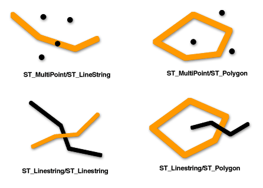

# @turf/boolean-crosses

<!-- Generated by documentation.js. Update this documentation by updating the source code. -->

## booleanCrosses

Boolean-Crosses returns True if the intersection results in a geometry whose dimension is one less than
the maximum dimension of the two source geometries and the intersection set is interior to
both source geometries.

Boolean-Crosses returns t (TRUE) for only multipoint/polygon, multipoint/linestring, linestring/linestring, linestring/polygon, and linestring/multipolygon comparisons.

**Parameters**

-   `feature1` **([Geometry](https://tools.ietf.org/html/rfc7946#section-3.1) \| [Feature](https://tools.ietf.org/html/rfc7946#section-3.2)&lt;any>)** GeoJSON Feature or Geometry
-   `feature2` **([Geometry](https://tools.ietf.org/html/rfc7946#section-3.1) \| [Feature](https://tools.ietf.org/html/rfc7946#section-3.2)&lt;any>)** GeoJSON Feature or Geometry

**Examples**

```javascript
var line1 = turf.lineString([[-2, 2], [4, 2]]);
var line2 = turf.lineString([[1, 1], [1, 2], [1, 3], [1, 4]]);

var cross = turf.booleanCrosses(line1, line2);
//=true
```

Returns **[boolean](https://developer.mozilla.org/en-US/docs/Web/JavaScript/Reference/Global_Objects/Boolean)** true/false

<!-- This file is automatically generated. Please don't edit it directly:
if you find an error, edit the source file (likely index.js), and re-run
./scripts/generate-readmes in the turf project. -->

---

This module is part of the [Turfjs project](http://turfjs.org/), an open source
module collection dedicated to geographic algorithms. It is maintained in the
[Turfjs/turf](https://github.com/Turfjs/turf) repository, where you can create
PRs and issues.

### Installation

Install this module individually:

```sh
$ npm install @turf/boolean-crosses
```

Or install the Turf module that includes it as a function:

```sh
$ npm install @turf/turf
```


### Diagrams

