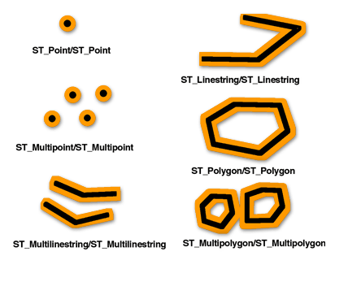

# @turf/boolean-equal

<!-- Generated by documentation.js. Update this documentation by updating the source code. -->

## booleanEqual

Determine whether two geometries of the same type have identical X,Y coordinate values.
See <http://edndoc.esri.com/arcsde/9.0/general_topics/understand_spatial_relations.htm>

**Parameters**

-   `feature1` **([Geometry](https://tools.ietf.org/html/rfc7946#section-3.1) \| [Feature](https://tools.ietf.org/html/rfc7946#section-3.2))** GeoJSON input
-   `feature2` **([Geometry](https://tools.ietf.org/html/rfc7946#section-3.1) \| [Feature](https://tools.ietf.org/html/rfc7946#section-3.2))** GeoJSON input

**Examples**

```javascript
var pt1 = turf.point([0, 0]);
var pt2 = turf.point([0, 0]);
var pt3 = turf.point([1, 1]);

turf.booleanEqual(pt1, pt2);
//= true
turf.booleanEqual(pt2, pt3);
//= false
```

Returns **[boolean](https://developer.mozilla.org/en-US/docs/Web/JavaScript/Reference/Global_Objects/Boolean)** true if the objects are equal, false otherwise

<!-- This file is automatically generated. Please don't edit it directly:
if you find an error, edit the source file (likely index.js), and re-run
./scripts/generate-readmes in the turf project. -->

---

This module is part of the [Turfjs project](http://turfjs.org/), an open source
module collection dedicated to geographic algorithms. It is maintained in the
[Turfjs/turf](https://github.com/Turfjs/turf) repository, where you can create
PRs and issues.

### Installation

Install this module individually:

```sh
$ npm install @turf/boolean-equal
```

Or install the Turf module that includes it as a function:

```sh
$ npm install @turf/turf
```


### Diagrams

